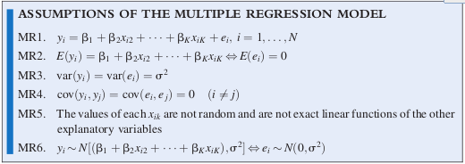

# 多元回归模型
Big Andy汉堡店需要评估价格策略和广告支出对销售的影响（数据集：andy.dat）。经济模型为：
$$SALES=\beta_1+\beta_2PRICE+\beta_3ADVERT$$
由于城市大小对销售额影响很大，我们只选择小城市作为样本。$PRICE$可采用某个价格指数。相应的计量模型为：
$$SALES=E(SALES)+e=\beta_1+\beta_2PRICE+\beta_3ADVERT+e$$
其中，系统部分是一个平面，称为回归平面。

一般的多元线性回归模型为：
$$y=\beta_1+\beta_2x_2+\beta_3x_3+\cdots+\beta_Kx_K+e$$
相应的，本例模型可以改写为：
$$y=\beta_1+\beta_2x_2+\beta_3x_3+e$$
我们作如下假设：

1. $E(e)=0$
2. $\mathrm{var}(e)=\sigma^2$
3. $\mathrm{cov}(e_i,e_j)=0$
4. $e\sim N(0,\sigma^2)$

从而，被解释变量具有性质：

1. $E(y)=\beta_1+\beta_2x_2+\beta_3x_3$
2. $\mathrm{var}(y)=\mathrm{var}(e)=\sigma^2$
3. $\mathrm{cov}(y_i,y_j)=\mathrm{cov}(e_i,e_j)=0$
4. $y\sim N[(\beta_1+\beta_2x_2+\beta_3x_3),\sigma^2]$

对解释变量施加两个额外假设后，得到多元回归模型的6个假设：

模型参数估计与简单线性回归类似，采用最小二乘法。对于汉堡店例子，可以得到：
$$b_1=118.91,\quad b_2=-7.908,\quad b_3=1.863,\qquad R^2=0.448$$
误差方差估计为：
$$\hat{\sigma}^2=\frac{\sum_{i=1}^N \hat{e}_i^2}{N-K}$$
其中$K$为系数个数。本例中，$\hat{\sigma}^2=23.874$，因此，回归标准误$\hat{\sigma}=4.8861$，也叫均方差（mean squared error，MSE）。有了标准误，就可以得到系数估计的抽样性质，比如方差和协方差等。类似简单线性回归，我们有GAUSS-MARKOV定理：对于满足MR1-MR5的多元回归模型，最小二乘估计是BLUE。此外，正态性假设也与前面类似，此处大样本的情况，一般认为$N-K=50$即可。容易计算系数估计的方差，比如对于$b_2$，可以证明：
$$\mathrm{var}(b_2)=\frac{\sigma^2}{(1-r_{23}^2)\sum_{i=1}^N(x_{i2}-\bar{x}_2)^2}$$
其中，$r_{23}$为$x_2$和$x_3$的样本相关系数。可以发现，除了误差方差、样本大小、解释变量变异性之外，另一个影响估计方差的因素是$x_2$和$x_3$的样本相关系数。其中的机理是，当$x_2$的变动与其他解释变量无关联时，其变异性会增加估计的准确性；但当其变动与其他变量有关系，就很难区分这两种效应。后面关于”共线性“的讨论将表明，共线性将增大估计方差。

通常将系数估计的方差和协方差组合在一个协方差矩阵中：
$$\mathrm{cov}(b_1,b_2,b_3)=
\left[                
  \begin{array}{ccc}  
    \mathrm{var}(b_1) & \mathrm{cov}(b_1,b_2) & \mathrm{cov}(b_1,b_2)\\
    \mathrm{cov}(b_2,b_1)  & \mathrm{var}(b_2) & \mathrm{cov}(b_2,b_3)\\
    \mathrm{cov}(b_3,b_1)  & \mathrm{cov}(b_3,b_2) & \mathrm{var}(b_3)
  \end{array}
\right]
$$
R中可以用``vcov(fit_model)``来获取该矩阵。为了进行区间估计和假设检验，需构造统计量，对于每个系数$b_k$，可构造与前面类似的t统计量，只不过自由度变成$N-K$。此时，系数的线性组合也服从t分布。

与简单线性回归类似，多元回归可以处理多项式模型（包括幂、交叉项），也可以包含对数。此外，也可以计算其拟合优度。具体例子参见POE。
